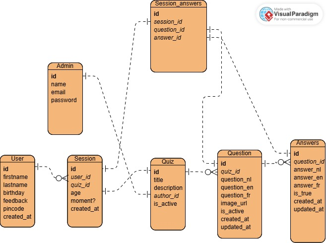

# @Work 2 - Boudewijn Seapark Quiz
## Made by Van Steenbergen Arno

### What is this?
This is my exam project for At-work 2 in the Graduaat Programmeren @ Arteveldehogeschool. The application is a Quiz with admin panel for Boudewijn Seapark. They requested a quiz that you can do twice (once before a presentation and one after), to test the knowledge of the users. And they wanted to be able to translate the quiz in 3 languages. They also wanted an admin panel with a period export system to excel. They wanted to be able to change the quiz questions/answers as well as the image.

### How to run?
1. Start by opening the whole folder in your editor and run `npm install` to download all the dependacies.
2. You will also need to create a `.env` file in the root of the project, just copy all the text from `.env-default` and paste it into the one you just made.
3. After it has downloaded all the packages and made the .env file, you can set up the database. first run `npx knex migrate:latest` to set up the database tables.
4. Now this line is optional but if you wanna load in the pre made data, like an admin user. Type `npx knex seed:run`.
5. Now that we have everything setup you can run the whole program with `npm run start:dev` it will open the website with [this link](http://localhost:3001)

### Technologies
- Node.js
- Sqlite3
- Knex.js
- EJS
- Dotenv
- Express
- Exceljs
- i18n
- Multer
- bcrypt
- luxon

### ERD
